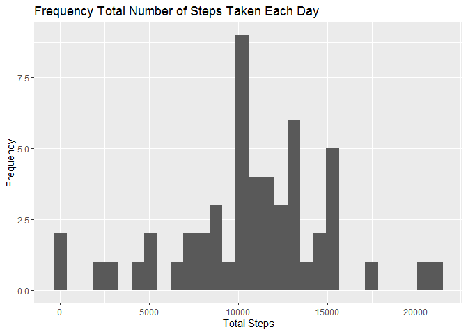
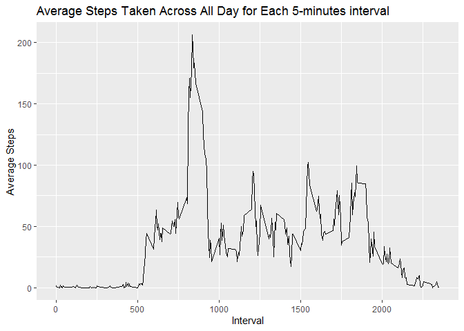
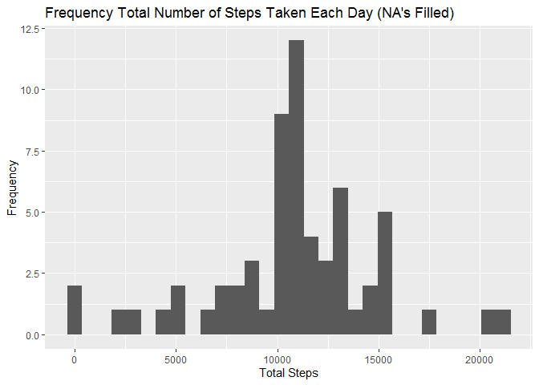
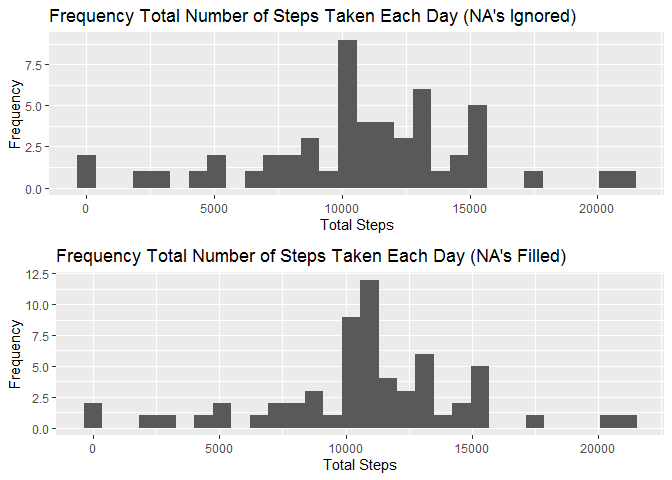
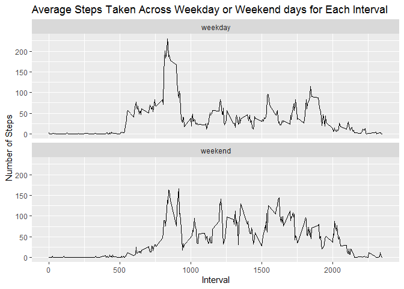

## Loading and preprocessing the data
Load any package needed

```r
library(dplyr)
```

```
## 
## Attaching package: 'dplyr'
```

```
## The following objects are masked from 'package:stats':
## 
##     filter, lag
```

```
## The following objects are masked from 'package:base':
## 
##     intersect, setdiff, setequal, union
```

```r
library(ggplot2)
library(data.table)
```

```
## 
## Attaching package: 'data.table'
```

```
## The following objects are masked from 'package:dplyr':
## 
##     between, first, last
```

```r
library(gridExtra)
```

```
## 
## Attaching package: 'gridExtra'
```

```
## The following object is masked from 'package:dplyr':
## 
##     combine
```

We load the data in 'activity.zip' which contain 'activity.csv'. Then look on its structure and summary.


```r
data <- read.csv(unz("activity.zip","activity.csv"))
str(data)
```

```
## 'data.frame':	17568 obs. of  3 variables:
##  $ steps   : int  NA NA NA NA NA NA NA NA NA NA ...
##  $ date    : Factor w/ 61 levels "2012-10-01","2012-10-02",..: 1 1 1 1 1 1 1 1 1 1 ...
##  $ interval: int  0 5 10 15 20 25 30 35 40 45 ...
```

```r
summary(data)
```

```
##      steps                date          interval     
##  Min.   :  0.00   2012-10-01:  288   Min.   :   0.0  
##  1st Qu.:  0.00   2012-10-02:  288   1st Qu.: 588.8  
##  Median :  0.00   2012-10-03:  288   Median :1177.5  
##  Mean   : 37.38   2012-10-04:  288   Mean   :1177.5  
##  3rd Qu.: 12.00   2012-10-05:  288   3rd Qu.:1766.2  
##  Max.   :806.00   2012-10-06:  288   Max.   :2355.0  
##  NA's   :2304     (Other)   :15840
```

We see there are a lot of NA's on the steps column.

## What is mean total number of steps taken per day?

1. Calculate the total number of steps per day
We are going to group up the total steps for each day and we will ignore the missing values in dataset, so we are goint to filtered the dataset.

```r
steps_day <- data %>%
  filter(!is.na(steps)) %>%
  group_by(date) %>%
  summarise(totalsteps = sum(steps))
head(steps_day)
```

```
## # A tibble: 6 x 2
##   date       totalsteps
##   <fct>           <int>
## 1 2012-10-02        126
## 2 2012-10-03      11352
## 3 2012-10-04      12116
## 4 2012-10-05      13294
## 5 2012-10-06      15420
## 6 2012-10-07      11015
```

2. Make a histogram of the total number of steps taken each day

```r
ggplot(steps_day, aes(x = totalsteps)) +
geom_histogram() +
labs(title = "Frequency Total Number of Steps Taken Each Day", x = "Total Steps", y = "Frequency")
```

```
## `stat_bin()` using `bins = 30`. Pick better value with `binwidth`.
```

<!-- -->

3. Calculate and report the mean and median of the total number of steps taken per day

```r
steps_day_mean <- mean(steps_day$totalsteps)
steps_day_mean
```

```
## [1] 10766.19
```

```r
steps_day_median <- median(steps_day$totalsteps)
steps_day_median
```

```
## [1] 10765
```
So we have the mean **1.0766189\times 10^{4}** and median **10765** of steps taken per day

## What is the average daily activity pattern?
1. Make a time series plot of the 5-minute interval (x-axis) and the average number of steps taken, averaged across all days (y-axis)

To do this, we first need to group up the average steps taken for the 5-minute interval accross all days


```r
steps_interval <- data %>%
  filter(!is.na(steps)) %>%
  group_by(interval) %>%
  summarise(averagesteps = mean(steps))
head(steps_interval)
```

```
## # A tibble: 6 x 2
##   interval averagesteps
##      <int>        <dbl>
## 1        0       1.72  
## 2        5       0.340 
## 3       10       0.132 
## 4       15       0.151 
## 5       20       0.0755
## 6       25       2.09
```

Make the time series plot


```r
ggplot(steps_interval, aes(x = interval, y = averagesteps)) +
geom_line() +
labs(title = "Average Steps Taken Across All Day for Each 5-minutes interval", x = "Interval", y = "Average Steps")
```

<!-- -->

2. Which 5-minute interval, on average across all the days in the dataset, contains the maximum number of steps?

The maximum number of steps is:

```r
max_steps <- max(steps_interval$averagesteps)
max_steps
```

```
## [1] 206.1698
```
Then the interval which contains the maximum number of steps is:

```r
max_stepsintv <- steps_interval[steps_interval$averagesteps == max_steps,]
max_stepsintv
```

```
## # A tibble: 1 x 2
##   interval averagesteps
##      <int>        <dbl>
## 1      835         206.
```

```r
max_stepsintvval <- max_stepsintv$interval
```

So the interval which contains maximum numer of step (**206.1698113**) is on **835** interval

## Inputing missing values
1. Calculate and report the total number of missing values in the dataset

We going to check the total of NA's value on each column in the dataset(original)


```r
colSums(is.na(data))
```

```
##    steps     date interval 
##     2304        0        0
```
We can see the total of NA's value perfectly match with previous check on summary of the dataset which on the steps column.

2. Devise a strategy for filling in all of the missing values in the dataset. 

We're going to fill the missing values of the dataset by replacing the NA's steps with **the mean steps for its 5-minute interval**. 

3. Create a new dataset that is equal to the original dataset but with the missing data filled in

We're already have the mean steps value for 5-minute interval from previous result. Now we need to fill the NA's value from it.


```r
data_fill <- data
for(i in 1:nrow(data_fill)){
  if (is.na(data_fill[i,1])){
    na_interval <- data_fill[i,3]
    data_fill[i,1]<- steps_interval[steps_interval$interval == na_interval,2]
  }
}
str(data_fill)
```

```
## 'data.frame':	17568 obs. of  3 variables:
##  $ steps   : num  1.717 0.3396 0.1321 0.1509 0.0755 ...
##  $ date    : Factor w/ 61 levels "2012-10-01","2012-10-02",..: 1 1 1 1 1 1 1 1 1 1 ...
##  $ interval: int  0 5 10 15 20 25 30 35 40 45 ...
```

```r
summary(data_fill)
```

```
##      steps                date          interval     
##  Min.   :  0.00   2012-10-01:  288   Min.   :   0.0  
##  1st Qu.:  0.00   2012-10-02:  288   1st Qu.: 588.8  
##  Median :  0.00   2012-10-03:  288   Median :1177.5  
##  Mean   : 37.38   2012-10-04:  288   Mean   :1177.5  
##  3rd Qu.: 27.00   2012-10-05:  288   3rd Qu.:1766.2  
##  Max.   :806.00   2012-10-06:  288   Max.   :2355.0  
##                   (Other)   :15840
```

4. Make a histogram of the total number of steps taken each day and Calculate and report the mean and median total number of steps taken per day. Do these values differ from the estimates from the first part of the assignment? What is the impact of imputing missing data on the estimates of the total daily number of steps?

First, we're going to make the histogram of total number of steps take each day using dataset which already NA's filled


```r
steps_day_fill <- data_fill %>%
  group_by(date) %>%
  summarise(totalsteps = sum(steps))

ggplot(steps_day_fill, aes(x = totalsteps)) +
geom_histogram() +
labs(title = "Frequency Total Number of Steps Taken Each Day (NA's Filled)", x = "Total Steps", y = "Frequency")
```

```
## `stat_bin()` using `bins = 30`. Pick better value with `binwidth`.
```

<!-- -->

Then, we calculate the mean and median :

```r
steps_day_mean_fill <- mean(steps_day_fill$totalsteps)
steps_day_mean_fill
```

```
## [1] 10766.19
```

```r
steps_day_median_fill <- median(steps_day_fill$totalsteps)
steps_day_median_fill
```

```
## [1] 10766.19
```
Thus We have the mean **1.0766189\times 10^{4}** and median **1.0766189\times 10^{4}** of steps taken per day with the NA's filled

Next, We compare the results from the data with NA's ignore and NA's filled:

```r
tab <- matrix(c(steps_day_mean, steps_day_median, steps_day_mean_fill, steps_day_median_fill), ncol = 2, byrow = TRUE)
rownames(tab) <- c("NA's Ignore","NA's Filled")
colnames(tab) <- c("Mean","Median")
tab
```

```
##                 Mean   Median
## NA's Ignore 10766.19 10765.00
## NA's Filled 10766.19 10766.19
```


```r
p1 <- ggplot(steps_day, aes(x = totalsteps)) +
geom_histogram() +
labs(title = "Frequency Total Number of Steps Taken Each Day (NA's Ignored)", x = "Total Steps", y = "Frequency")

p2 <- ggplot(steps_day_fill, aes(x = totalsteps)) +
geom_histogram() +
labs(title = "Frequency Total Number of Steps Taken Each Day (NA's Filled)", x = "Total Steps", y = "Frequency")

grid.arrange(p1, p2)
```

```
## `stat_bin()` using `bins = 30`. Pick better value with `binwidth`.
## `stat_bin()` using `bins = 30`. Pick better value with `binwidth`.
```

<!-- -->

We can see on table result, there is litte difference on median value while the mean value remains the same between datasets of total steps with NA's ignore and NA's filled.

We can also see on the compared histogram, there is slight difference between the two datasets in the middle area. Also, having the NA's filled on the datasets makes it more populate(frequency increase on the middle area)

## Are there differences in activity patterns between weekdays and weekends?

1. Create a new factor variable in the dataset with two levels – “weekday” and “weekend” indicating whether a given date is a weekday or weekend day

First, we create day column from the available date column. Then, we can extract the weekday and weekend of respective day and create a factor from it.

```r
data_fill$day <- weekdays.Date(as.POSIXct(data_fill$date), abbr = TRUE)
data_fill$week <- ifelse(data_fill$day %in% c("Sat","Sun"), "weekend", "weekday")
data_fill$week <- as.factor(data_fill$week)
summary(data_fill)
```

```
##      steps                date          interval          day           
##  Min.   :  0.00   2012-10-01:  288   Min.   :   0.0   Length:17568      
##  1st Qu.:  0.00   2012-10-02:  288   1st Qu.: 588.8   Class :character  
##  Median :  0.00   2012-10-03:  288   Median :1177.5   Mode  :character  
##  Mean   : 37.38   2012-10-04:  288   Mean   :1177.5                     
##  3rd Qu.: 27.00   2012-10-05:  288   3rd Qu.:1766.2                     
##  Max.   :806.00   2012-10-06:  288   Max.   :2355.0                     
##                   (Other)   :15840                                      
##       week      
##  weekday:12960  
##  weekend: 4608  
##                 
##                 
##                 
##                 
## 
```
2. Make a panel plot containing a time series plot of the 5-minute interval (x-axis) and the average number of steps taken, averaged across all weekday days or weekend days (y-axis)

Then We need to create steps interval group up by interval and weekday or weekend.

```r
steps_interval_a <- data_fill %>%
   group_by(interval, week) %>%
   summarise(averagesteps = mean(steps))
```
Create the panel plot

```r
  ggplot(steps_interval_a, aes(x = interval, y = averagesteps)) +
  geom_line() +
  facet_wrap(~ week, ncol = 1, nrow = 2) +
  labs(title = "Average Steps Taken Across Weekday or Weekend days for Each Interval", x = "Interval", y = "Number of Steps")
```

<!-- -->
